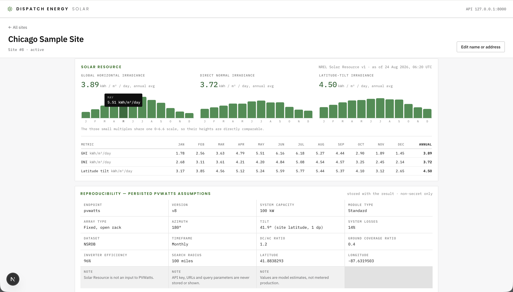
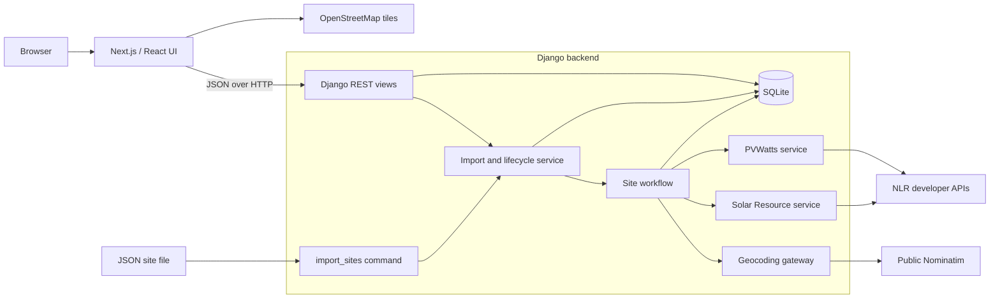

# Dispatch Energy Solar

A local Django and Next.js application for importing U.S. solar sites, resolving
their addresses, displaying resolved locations on a map, and reviewing Solar
Resource V1 and PVWatts V8 results. All active sites stay visible in the
catalogue even when an address cannot be mapped or a provider fails.

## What the application does

- Imports named sites from JSON in additive (`upsert`) or authoritative (`sync`)
  mode.
- Geocodes new or meaningfully changed addresses through Nominatim.
- Retrieves Solar Resource irradiance and an independent PVWatts production
  estimate for each resolved location.
- Shows one marker per active, resolved site and a catalogue row for every active
  site.
- Preserves safe, stage-specific status, error, result, and last-attempt data.
- Supports focused retries, site edits, browser uploads, soft deactivation, and
  Django Admin lifecycle actions.

## Screenshots

**Landing page:** the complete active catalogue beside the map. Sites are split
between **On the map** and **Not on the map**.


**Site detail:** resolved location, processing state, results, assumptions, and
focused retry actions.




## Run locally from a clean checkout

### Prerequisites

- Python 3.12-3.14
- [`uv`](https://docs.astral.sh/uv/getting-started/installation/)
- [Bun](https://bun.sh/)
- A free [NLR developer API key](https://developer.nlr.gov/signup/)

### 1. Install and configure

From the repository root:

```sh
make setup
```

`make setup`:

1. Copies `.env.example` to `.env` only when `.env` does not exist.
2. Copies `frontend/.env.local.example` to `frontend/.env.local` only when the
   local file does not exist.
3. Installs the locked backend and frontend dependencies.
4. Applies Django migrations.

Edit `.env` and replace the two placeholders before importing sites:

```dotenv
NLR_API_KEY=your-nlr-api-key
NLR_API_BASE=https://developer.nlr.gov
CONTACT_EMAIL=you@example.com
NOMINATIM_BASE_URL=https://nominatim.openstreetmap.org
```

The contact email identifies this application to the public Nominatim service.
Do not commit `.env`; it is ignored by Git.

### 2. Import the sample sites

```sh
make import-upsert
```

The tracked sample contains six named sites, including one deliberately
unresolvable address. A successful import therefore leaves at least five named
active sites available in the application. Re-running the same command is
idempotent and makes no provider requests for unchanged rows.

### 3. Start the backend

```sh
make backend
```

The Django API and Admin are available at <http://127.0.0.1:8000/api/> and
<http://127.0.0.1:8000/admin/>.

### 4. Start the frontend

In a second terminal:

```sh
make frontend
```

Open <http://127.0.0.1:3000>. The backend accepts only the expected localhost
frontend origins; credentialed and allow-all CORS are disabled.

## Everyday commands

Run these from the repository root.

| Command | Purpose |
| --- | --- |
| `make setup` | Copy missing local env files, install locked dependencies, and migrate. |
| `make backend` | Start Django at `127.0.0.1:8000`. |
| `make frontend` | Start Next.js at `127.0.0.1:3000`. |
| `make import-upsert` | Add new pairs and reactivate exact matches without deactivating omitted sites. |
| `make import-sync` | Treat the input as the complete active set and deactivate omitted sites. |
| `make verify` | Run the complete offline backend and frontend verification suite. |
| `make live-check` | Explicitly make three non-mutating provider connectivity requests. |
| `make test` | Compatibility alias for `make verify`. |
| `make check-apis` | Compatibility alias for `make live-check`. |

Both import targets use `data/sites_initial.json` by default. Supply another
JSON array with a root-relative or absolute path when needed:

```sh
make import-upsert SITES_FILE=data/another-site-set.json
make import-sync SITES_FILE=/absolute/path/to/authoritative-sites.json
```

Each row has this shape:

```json
{
  "name": "Boston Sample Site",
  "address": "1 City Hall Square, Boston, MA 02201"
}
```

`make import` remains a compatibility alias for the original authoritative
`import-sync` behavior. Prefer the explicit target so the deactivation behavior
is visible at the call site.

## Architecture



### Responsibilities and provider boundaries

- **Next.js/React** owns presentation and user interaction. A single API client
  owns all backend requests; rendering and GET requests never trigger provider
  work.
- **Django REST views** validate the HTTP contract and translate domain outcomes
  into safe responses. They delegate imports, lifecycle changes, and processing
  rather than constructing provider requests.
- **Import and workflow services** own identity matching, reconciliation,
  invalidation, processing order, and commit-before-call behavior. The browser
  upload and management command converge on the same import path.
- **Provider services** are separate adapters for Nominatim, Solar Resource, and
  PVWatts. They build requests, validate only consumed response fields, and
  persist canonical application data instead of raw provider bodies.
- **SQLite** is the local source of truth for Site lifecycle and the latest
  handled outcome of each processing stage.

### Site identity and lifecycle

A database ID identifies a specific Site record. Imports match only the pair of
normalized `(name, address)` values; neither field is unique alone. Normalizing
applies Unicode NFKC, replaces punctuation with spaces, collapses whitespace,
and case-folds. Display strings are still stored exactly as accepted.

Sharing only a name or only an address creates a separate record and reports a
warning; the application never guesses that two rows are the same physical
asset. Active/inactive lifecycle is independent of provider status. Normal
operation soft-deactivates records and preserves their results for later
reactivation.

### Import and update workflow

`upsert` adds valid new pairs, retains active exact matches, and reactivates
inactive exact matches. Invalid rows are reported while other rows continue.
It never deactivates a record merely because it is omitted.

`sync` first validates the complete file, then atomically creates, reactivates,
and deactivates records so the file becomes the complete active set. Any
structurally invalid row aborts reconciliation with no lifecycle changes.

For each genuinely new Site, processing is sequential:

1. Commit geocoding as `pending` and both downstream stages as `blocked`.
2. Geocode the verbatim address and persist the handled outcome.
3. When resolved, request Solar Resource and persist its outcome.
4. Run PVWatts independently, even if Solar Resource failed.

An address-changing PATCH and an explicit geocoding refresh clear stale
location-dependent values and commit that empty pending/blocked state before
external I/O. Name-only and normalization-equivalent cosmetic edits preserve
provider state. Solar Resource and PVWatts retries clear only their own stage.

## Invalid and unresolvable addresses

The application distinguishes bad input, no match, and provider failure:

- A row missing a non-empty string `name` or `address`, including punctuation-
  only input, is structurally invalid. `upsert` rejects that row and continues;
  `sync` aborts before changing any Site lifecycle state.
- A valid address for which Nominatim returns no U.S. result becomes
  `unresolved` with the safe explanation **No matching U.S. location was found
  for this address.** Coordinates remain null and both downstream stages remain
  `blocked`.
- A timeout, connection problem, non-success HTTP response, or malformed
  consumed response becomes `failed` with a concise stage-specific error. Raw
  provider bodies, URLs, query parameters, API keys, headers, and exception text
  are never persisted or shown.

Unresolved and failed Sites remain active and visible under **Not on the map**,
but never receive a marker. Their detail pages show the stage outcome and a
focused geocoding retry. A later failure never restores stale coordinates or
solar results.

## Key tradeoffs

| Decision | Benefit | Cost / boundary |
| --- | --- | --- |
| Synchronous, sequential processing | Simple local behavior, honest results, and easy verification. | Imports and meaningful edits wait for providers; no queue or automatic retry. |
| Commit before external I/O | Accepted state and stale-data removal survive provider or process failures. | A crash can intentionally leave a stage `pending` for manual recovery. |
| Exact normalized identity pair | Deterministic imports without requiring an external ID. | Semantic duplicates are warned about, not merged automatically. |
| SQLite and process-local controls | Minimal setup for a small local assessment. | Not a multi-user or multi-process production architecture. |
| Public Nominatim behind one gateway | Free, replaceable geocoding at assessment scale. | Production/high-volume use needs a commercial provider or self-hosted Nominatim and a distributed limiter. |
| Canonical stored results, not raw responses | Stable API/UI shapes and no provider-body leakage. | New consumed fields require an explicit validator/model change. |
| No persistent provider cache | Retries are fresh and records remain independent. | Only unchanged records and one import's identical address queries avoid repeat calls. |

## Nominatim policy and attribution

Public Nominatim is donated infrastructure and is appropriate here only for
this small, single-process local assessment. Review the official
[Nominatim usage policy](https://operations.osmfoundation.org/policies/nominatim/).
Production or higher-volume use must use a commercial provider or self-hosted
Nominatim with an appropriate distributed rate limiter.

| Policy / operational concern | Application control |
| --- | --- |
| Custom User-Agent | Every request sends `dispatch-solar-assessment/1.0`; the configured `CONTACT_EMAIL` is included for operator identification. |
| Single-threaded request gate | One process-local lock covers both the rate gate and the entire HTTP request, serializing all search and status traffic through one shared gateway/session. |
| Request spacing | Nominatim request starts are spaced at least 1.1 seconds apart using a monotonic clock. |
| Caching and repeat work | One import reuses handled results for byte-identical verbatim addresses; unchanged later imports make no call. There is no cross-run provider cache. |
| Request triggers | Only a new import, a normalized address change, or an explicit geocoding retry performs a search. GETs, page loads, typing, and autocomplete never geocode. |
| Timeouts | Every Nominatim request has an explicit 10-second timeout. NLR requests also use explicit 10-second timeouts. |
| Attribution | Map tiles show [OpenStreetMap tile attribution](https://www.openstreetmap.org/copyright); the UI separately credits OpenStreetMap/Nominatim geocoding. |
| Local-only suitability | The limiter is process-local and the data set is deliberately small. This is not a production geocoding architecture. |

## API

The backend serves these endpoints under `http://127.0.0.1:8000/api/`:

| Method and path | Purpose |
| --- | --- |
| `GET /sites/` | List every active Site with map and catalogue fields. |
| `GET /sites/<id>/` | Return complete stored state for one active Site. |
| `PATCH /sites/<id>/` | Edit name/address; a normalized address change runs the full workflow. |
| `POST /sites/<id>/geocode/` | Clear location-dependent data and run the full workflow. |
| `POST /sites/<id>/solar-resource/` | Clear and retry Solar Resource only; resolved coordinates required. |
| `POST /sites/<id>/pvwatts/` | Clear and retry PVWatts only; resolved coordinates required. |
| `POST /sites/import/` | Browser-safe `upsert` import only. |
| `POST /sites/deactivate/` | Soft-deactivate selected active Sites without provider calls. |

Inactive IDs return `404` through the application API. Django Admin provides
bulk deactivate/reactivate actions that change lifecycle only.

## Verification

### Complete offline suite

```sh
make verify
```

This runs backend pytest, mypy, Ruff lint/format checks, Django system and
migration checks, plus frontend Vitest, TypeScript, and ESLint. Backend tests
are offline by construction: `pytest-socket` disables sockets for the ordinary
suite. Running the application and `make live-check` are the only intended live
provider paths.

### Explicit live connectivity check

After replacing the `.env` placeholders:

```sh
make live-check
```

The opt-in check makes exactly three requests:

1. Nominatim's status endpoint through the shared, policy-controlled gateway.
2. Solar Resource V1 for fixed coordinates `40, -105`, parsed by the production
   validator.
3. PVWatts V8 for the same fixed coordinates, parsed by the production
   validator.

It reads/writes/deletes no Site record and prints no key, full request URL,
query parameters, provider body, or raw request exception. Missing
configuration or any connectivity/contract failure produces safe output and a
nonzero exit status. The check is excluded from ordinary tests and CI events;
the GitHub Actions live pytest job is manual only. `make check-apis` is retained
as an alias for the same operator command.

## Configuration reference

| Variable | Where | Purpose |
| --- | --- | --- |
| `NLR_API_KEY` | `.env` | Required for Solar Resource and PVWatts. There is no demo-key fallback. |
| `NLR_API_BASE` | `.env` | NLR developer API base; defaults to `https://developer.nlr.gov`. |
| `CONTACT_EMAIL` | `.env` | Included in the Nominatim User-Agent; use a real monitored contact for live calls. |
| `NOMINATIM_BASE_URL` | `.env` | Shared geocoding/status service base. |
| `NEXT_PUBLIC_API_BASE_URL` | `frontend/.env.local` | Browser-visible Django API base; defaults to `http://127.0.0.1:8000/api`. |

NLR developer APIs have a default limit of 1,000 requests per hour per key.
Provider configuration failures affect their individual processing stages; they
do not prevent the local application from starting.
